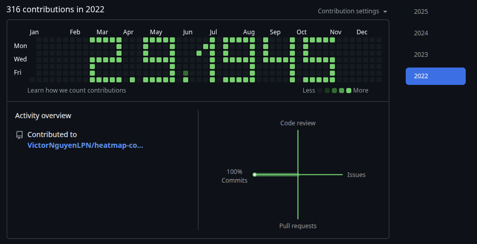

# heatmap-config (Github contribution pixel art)

This project generates a **pixel-art pattern** (the text "2/9") on your GitHub contribution graph by creating commits on specific dates.  

The script allows you to:  
- Automatically commit on specific dates to "draw" the pattern.  
- Center the pattern on the GitHub graph.  
- Customize the starting date (must be a **Sunday** for correct alignment).  
- Adjust the number of commits per pixel to control color intensity.

---

## Requirements

- Python 3.7+  
- Git installed and configured with your GitHub email:  

## Installation
- Clone this repository:
    ```bash
    git clone https://github.com/VictorNguyenLPN/heatmap-config.git
    cd github-art
    ```
- Initialize your own repo with an initial commit
    ```bash
    echo "start" > log.txt
    git add log.txt
    git commit -m "init"
    git branch -M main
    git remote add origin https://github.com/<your-username>/<your-repo-name>.git
    git push -u origin main
    ```

## Usage
1. Run on Linux/macOS
   ```bash
   python3 -m venv .venv
   source .venv/bin/activate

   python3 main.py 2023-07-16

   git push origin main
   ```
2. Run on Window (PowerShell)
   ```bash
   python -m venv venv
   venv\Scripts\activate

   python main.py 2023-07-16

   git push origin main
   ```
> Where 2023-07-16 is the start date (must be Sunday) for the pattern.
> The script will commit multiple times per day (default = 3) for each pixel (#) in the pattern.

## Demo
Example preview of the "2/9" pixel pattern (rendered similar to GitHub contribution graph):


> Note: On GitHub the default color is green. You can use browser extensions (like Stylus) to change the color to red if you prefer.